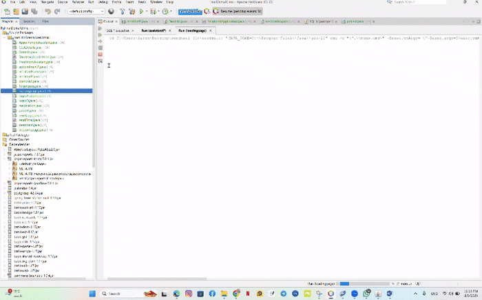

# 🦷 Dental Clinic Management System

A desktop-based dental clinic management system developed using Java.  
The project helps organize dental clinic operations such as patient management, dentist management, appointments, treatments, diagnosis records, medication details, cost details, and email communication.

## 📌 Project Overview

This project is designed for a dental clinic to make clinic management easier and more organized.  
It provides different interfaces for users such as dentists and assistants, allowing them to manage patient information, appointments, treatments, and clinic-related records through a graphical user interface.

The system also includes email functionality for communication and password recovery.



## ✨ Features

- Login system
- Forgot password and reset password pages
- Dentist interface
- Assistant interface
- Patient management
- Appointment management
- Treatment management
- Diagnosis records
- Medication management
- Cost details management
- Email sending functionality
- User-friendly Java GUI forms
- Images and animations included in the application

## 🛠️ Technologies Used

- Java
- Java Swing GUI
- Maven
- Spring Boot structure
- Java Mail API
- Activation JAR
- Mail JAR

## 📁 Project Structure

```text
Dental-clinic/
├── sendmail/
│   ├── HELP.md
│   ├── mvnw
│   ├── mvnw.cmd
│   ├── pom.xml
│   └── src/
│       ├── main/
│       │   ├── java/
│       │   │   └── com/
│       │   │       └── clinicemail/
│       │   │           └── sendmail/
│       │   │               ├── appointment1.java
│       │   │               ├── AppointmentAssistant.java
│       │   │               ├── assistantFrame.java
│       │   │               ├── assistantP.java
│       │   │               ├── CostDetails.java
│       │   │               ├── Dentists.java
│       │   │               ├── dianosis1.java
│       │   │               ├── forgotpass.java
│       │   │               ├── loadingpage.java
│       │   │               ├── loginAssitant.java
│       │   │               ├── loginD.java
│       │   │               ├── medication.java
│       │   │               ├── patient.java
│       │   │               ├── resetpage.java
│       │   │               ├── sendEmail.java
│       │   │               ├── SendmailApplication.java
│       │   │               ├── treatment.java
│       │   │               ├── TreatmentAssistant.java
│       │   │               └── wlecomepage.java
│       │   └── resources/
│       │       ├── application.properties
│       │       └── images/
│       └── test/
│           └── java/
│               └── com/
│                   └── clinicemail/
│                       └── sendmail/
│                           └── SendmailApplicationTests.java
├── activation.jar
├── mail.jar
└── README.md
